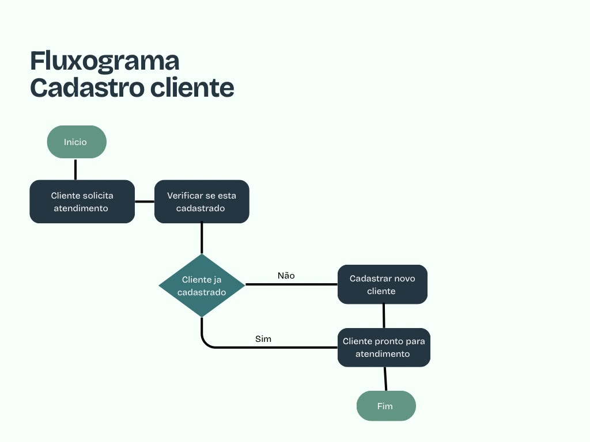
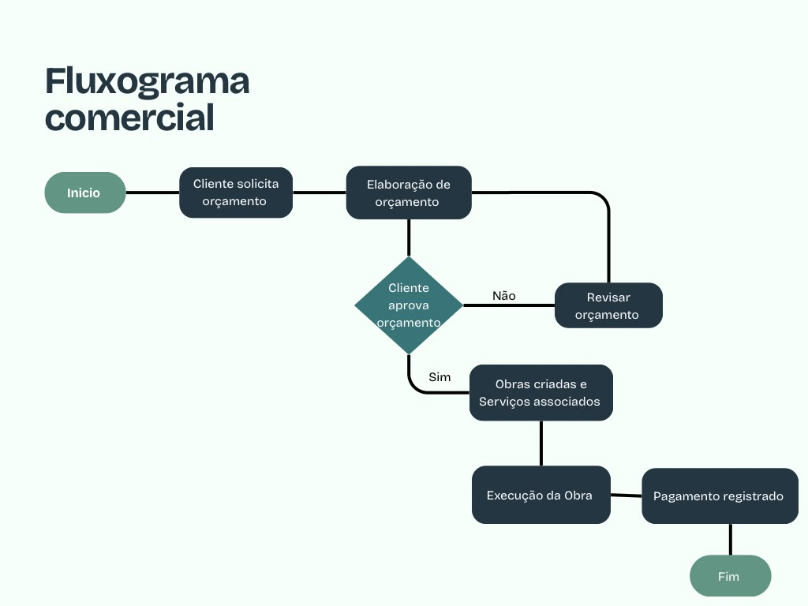
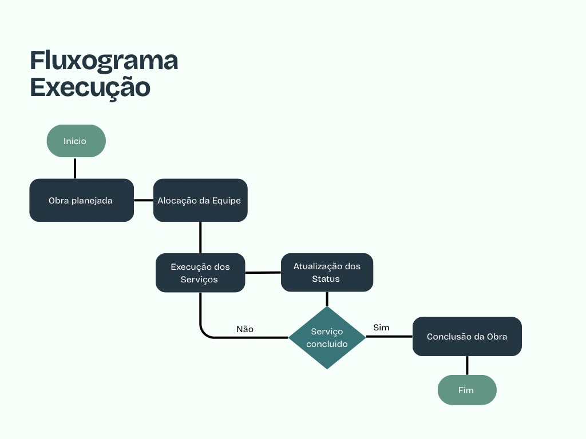

# Entrega 1 — Modelo Conceitual (DER)
### Modelagem de um sistema de gestão de informações para uma organização de pequeno porte

---

# Modelagem de Banco de Dados para a JG Construções


## Introdução

A JG Construções LTDA é uma empresa de pequeno/médio porte do ramo da construção civil que atualmente não possui nenhum sistema informatizado de gestão: informações de clientes, obras, orçamentos, serviços prestados e pagamentos ficam espalhadas entre planilhas, anotações em papel e conversas informais. Esse cenário dificulta o controle do andamento das obras, a consulta rápida de dados e a geração de relatórios gerenciais.

Objetivo desse trabalho é criar um sistema centralizado para armazenar, organizar, consultar e proteger as informações da empresa, facilitando o gerenciamento das obras e dos serviços prestados.

A delimitação desta primeira entrega é o **núcleo do ciclo orçamento → obra**: cadastro de cliente, orçamento de serviços, execução da obra com equipe alocada, compra de material junto a fornecedores e controle de pagamento por etapa.

## Desenvolvimento

### Caracterização da Organização

- **Nome e natureza da organização:** JG Construções — empresa privada com fins lucrativos, do ramo de reformas e construção civil de pequeno porte.
- **Contexto e porte:** *empresa registrada como ME (microempresa) junto à Receita Federal, mas que opera atualmente com cerca de 20 ou mais pessoas envolvidas entre equipe efetiva e prestadores/subcontratados nas obras.
- **Problemas e necessidades identificados:** antes do sistema proposto, orçamentos, obras, alocação de equipe e compra de material eram controlados de forma manual/dispersa, sem um cadastro único de clientes nem histórico organizado de qual funcionário trabalhou em qual obra, ou quanto foi gasto em material por obra.
- **Justificativa da escolha:**  A empresa foi escolhida por apresentar uma necessidade de melhorar a organização de informações sobre clientes, serviços e orçamentos. O desenvolvimento de um sistema pode facilitar essas atividades, tornando o trabalho mais rápido e organizado.
- **Evidências da organização:** Nome e natureza da organização: JG Construções LTDA
 (nome fantasia: JG Construções), Sociedade Empresária Limitada, com fins lucrativos.
CNPJ: 63.489.213/0001-49 (Matriz)
Situação cadastral: Ativa (desde 03/11/2025)
Endereço: R. Alberta Hunter, 761, Vila Brasil, São Paulo – SP, CEP 08.210-681
Contato: (11) 8161-3422 · jovaldo.santos@hotmail.com


---

### Processos de Negócio


**Principais processos mapeados:**
1. *Cadastro de cliente* — nome, CPF/CNPJ, telefone, e-mail e endereço.
2. *Cadastro de obras*— registro de uma obra com endereço, cliente responsável, tipo de serviço e período de execução.
3. *Cadastro de serviços* — registro do catálogo de serviços oferecidos (pintura, elétrica, hidráulica, acabamento, manutenção etc.).
4. *Orçamento* — a partir de um catálogo de serviços (com valor de referência), monta-se um orçamento para o cliente, item a item, com validade e valor total.
5. *Execução e acompanhamento da obra* — controle do status (planejada, em andamento, pausada, concluída).
6. *Registro de pagamentos* — lançamento dos pagamentos referentes a serviços/obras.

**Fluxogramas:**

**1. Cadastro de cliente**



**2. Comercial (orçamento)**



**3. Execução da obra**



Fluxo principal, em texto, para orientar o desenho do fluxograma:

```
Cliente pede orçamento
   → Orçamento é montado (itens do catálogo de serviços, com valor)
      → Cliente aprova o orçamento
         → Obra é aberta (endereço, escopo, prazo)
            ├─ Equipe é alocada na obra (funcionário + função + período)
            ├─ Material é comprado de fornecedor(es) para a obra
            ├─ Serviços orçados são executados na obra
            └─ Pagamento é recebido por etapa, até a conclusão
```

---

#### Requisitos Funcionais

RF01 – Cadastrar clientes

O sistema deve permitir o cadastro, consulta, alteração e exclusão dos dados dos clientes.

Especificações:

* Cadastrar nome completo ou razão social;
* CPF ou CNPJ;
* Telefone;
* E-mail;
* Endereço;
* Data de cadastro;
* Observações;
* Permitir consultar clientes cadastrados;
* Permitir alterar dados existentes;
* Permitir excluir ou inativar um cadastro;
* O sistema deve verificar se CPF/CNPJ já está cadastrado;
* Campos obrigatórios não poderão ser deixados em branco.

Usuário responsável: administrador ou funcionário autorizado.

⸻

RF02 – Cadastrar obras

O sistema deve permitir registrar e gerenciar as obras contratadas pela empresa.

Especificações:

* Número ou código da obra;
* Nome ou identificação da obra;
* Cliente responsável;
* Endereço da obra;
* Tipo de serviço;
* Data de início prevista;
* Data de término prevista;
* Data de término efetiva;
* Descrição da obra;
* Valor estimado;
* Responsável pela obra;
* Status da obra.

Status possíveis:

* Planejada;
* Em andamento;
* Pausada;
* Concluída;
* Cancelada.

O sistema deve permitir consultar, alterar e atualizar as informações da obra.

Usuário responsável: administrador, gestor ou funcionário autorizado.

⸻

RF03 – Cadastrar serviços

O sistema deve permitir cadastrar e gerenciar os serviços oferecidos pela empresa.

Exemplos:

* Pintura;
* Instalação elétrica;
* Serviços hidráulicos;
* Acabamento;
* Manutenção;
* Reforma;
* Instalação de pisos;
* Outros serviços de construção.

Especificações:

* Código do serviço;
* Nome;
* Descrição;
* Categoria;
* Valor estimado ou preço-base;
* Unidade de medida, quando aplicável;
* Status: ativo ou inativo.

O sistema deve permitir alterar ou inativar serviços que não sejam mais oferecidos.

⸻

RF04 – Associar serviços às obras

O sistema deve permitir relacionar um ou mais serviços a uma determinada obra.

Especificações:

* Identificar a obra;
* Identificar o cliente;
* Selecionar o serviço;
* Informar profissional responsável;
* Informar quantidade;
* Informar valor do serviço;
* Registrar data de início;
* Registrar data de conclusão;
* Informar status do serviço;
* Adicionar observações.

Uma obra poderá possuir vários serviços, e cada serviço poderá estar relacionado a diferentes obras.

⸻

RF05 – Cadastrar funcionários e prestadores

O sistema deve permitir cadastrar os profissionais envolvidos na execução dos serviços.

Especificações:

* Nome completo;
* CPF;
* Telefone;
* E-mail;
* Endereço;
* Cargo ou função;
* Tipo de vínculo;
* Especialidade;
* Data de cadastro;
* Status do profissional.

O sistema deve diferenciar funcionários contratados pela empresa de prestadores de serviços terceirizados.

⸻

RF06 – Registrar orçamento

O sistema deve permitir criar, consultar e gerenciar orçamentos solicitados pelos clientes.

Especificações:

* Número do orçamento;
* Cliente;
* Data de emissão;
* Prazo de validade;
* Serviços solicitados;
* Quantidade;
* Valores individuais;
* Descontos, quando aplicável;
* Valor total;
* Forma de pagamento;
* Prazo estimado para execução;
* Observações;
* Responsável pelo orçamento.

Status possíveis:

* Em elaboração;
* Enviado;
* Aprovado;
* Recusado;
* Expirado;
* Cancelado.

O sistema deve calcular automaticamente o valor total do orçamento com base nos serviços cadastrados.

⸻

RF07 – Registrar pagamentos

O sistema deve permitir registrar os pagamentos relacionados às obras e aos serviços contratados.

Especificações:

* Cliente;
* Obra;
* Orçamento ou serviço relacionado;
* Data do pagamento;
* Valor pago;
* Forma de pagamento;
* Número ou identificação da parcela;
* Status do pagamento;
* Observações.

Formas de pagamento:

* Dinheiro;
* PIX;
* Cartão;
* Transferência bancária;
* Boleto;
* Outras formas cadastradas.

O sistema deve permitir consultar os pagamentos realizados e identificar valores pendentes.

⸻

RF08 – Consultar informações

O sistema deve permitir pesquisar e consultar os dados armazenados no banco de dados.

A pesquisa deverá permitir filtros por:

* Cliente;
* Obra;
* Serviço;
* Funcionário;
* Prestador;
* Orçamento;
* Pagamento;
* Status;
* Período.

O sistema deve apresentar os resultados de forma organizada e permitir acessar os detalhes do registro selecionado.

⸻

RF09 – Gerar relatórios

O sistema deve permitir gerar relatórios para auxiliar no controle administrativo e operacional da empresa.

Relatórios previstos:

* Relatório de clientes cadastrados;
* Relatório de obras;
* Obras em andamento;
* Obras concluídas;
* Serviços realizados;
* Serviços por obra;
* Funcionários e prestadores;
* Orçamentos aprovados e recusados;
* Pagamentos realizados;
* Pagamentos pendentes;
* Valores recebidos por período.

Os relatórios devem permitir filtros por período, cliente, obra e status, quando aplicável.

⸻

RF10 – Controlar o andamento das obras

O sistema deve permitir acompanhar o andamento de cada obra.

Especificações:

* Registrar o status atual da obra;
* Atualizar o status conforme o andamento;
* Registrar data da alteração;
* Identificar o responsável pela alteração;
* Permitir visualizar o histórico de status;
* Associar serviços e profissionais à obra;
* Informar observações sobre o andamento.

Status:

1. Planejada;
2. Em andamento;
3. Pausada;
4. Concluída;
5. Cancelada.

#### Requisitos Não Funcionais

RNF01 – Segurança

O sistema deve garantir a proteção dos dados armazenados e restringir o acesso às informações de acordo com o nível de autorização de cada usuário.

Especificações:

* Login e senha para acesso;
* Senhas armazenadas de forma segura;
* Controle de permissões;
* Bloqueio de acesso a usuários não autorizados;
* Encerramento de sessão após período de inatividade;
* Registro das principais ações realizadas pelos usuários.

⸻

RNF02 – Desempenho

O sistema deve apresentar bom desempenho durante as operações de cadastro, consulta, alteração e geração de relatórios.

Especificações:

* Consultas comuns devem apresentar resultados rapidamente;
* O banco de dados deve possuir estrutura adequada para grandes quantidades de registros;
* Índices devem ser utilizados quando necessários;
* O sistema não deve apresentar lentidão significativa com o crescimento da base de dados.

⸻

RNF03 – Usabilidade

A interface deve ser simples, intuitiva e fácil de utilizar.

Especificações:

* Menus organizados por categoria;
* Botões e campos identificados claramente;
* Formulários padronizados;
* Mensagens de erro compreensíveis;
* Confirmação antes de operações importantes, como exclusão;
* Layout organizado;
* Navegação simples;
* Adaptação para diferentes tamanhos de tela, quando aplicável.

⸻

RNF04 – Disponibilidade

O sistema deve estar disponível durante o horário de funcionamento da empresa.

Especificações:

* O sistema deve permanecer acessível durante o período de trabalho;
* Manutenções programadas devem ser realizadas preferencialmente fora do horário de funcionamento;
* Em caso de falha, o sistema deverá permitir recuperação dos dados por meio do backup;
* Erros críticos devem ser registrados para análise.

⸻

RNF05 – Integridade dos dados

O sistema deve garantir que os dados armazenados sejam corretos, completos e consistentes.

Especificações:

* Impedir cadastro duplicado de CPF/CNPJ;
* Validar campos obrigatórios;
* Validar formatos de e-mail e telefone;
* Utilizar chaves primárias e estrangeiras no banco de dados;
* Impedir a criação de relacionamentos inexistentes;
* Evitar valores inválidos;
* Manter a consistência entre clientes, obras, serviços e pagamentos.

Exemplo: não deve ser possível associar uma obra a um cliente que não esteja cadastrado.

⸻

RNF06 – Backup

O sistema deve realizar cópias de segurança periódicas dos dados armazenados.

Especificações:

* Realizar backups automaticamente;
* Definir periodicidade para as cópias;
* Armazenar backups em local seguro;
* Manter mais de uma cópia quando possível;
* Permitir recuperação dos dados em caso de falha;
* Restringir o acesso aos arquivos de backup.

⸻

RNF07 – Escalabilidade

O sistema deve permitir o crescimento da quantidade de informações sem comprometer significativamente seu funcionamento.

Especificações:

* Suportar aumento no número de clientes;
* Suportar aumento no número de obras;
* Suportar aumento no número de serviços;
* Suportar aumento no número de funcionários e prestadores;
* Permitir expansão futura das funcionalidades;
* Utilizar estrutura de banco de dados preparada para crescimento.

⸻

RNF08 – Privacidade

O sistema deve proteger os dados pessoais dos clientes, funcionários e prestadores, seguindo os princípios estabelecidos pela Lei Geral de Proteção de Dados (LGPD).

Especificações:

* Coletar somente os dados necessários para as finalidades do sistema;
* Restringir o acesso a informações pessoais;
* Permitir acesso aos dados conforme autorização;
* Proteger os dados contra acesso não autorizado;
* Evitar exposição desnecessária de informações pessoais;
* Manter registros e procedimentos adequados para tratamento dos dados;
* Permitir a exclusão ou correção de dados quando aplicável e conforme as regras legais.
---

### Regras de Negócio

- **Regras operacionais:**
  - Uma obra só pode ser aberta a partir de um orçamento aprovado pelo cliente (status do orçamento precisa refletir essa aprovação).
  - Um pagamento é sempre vinculado a uma obra específica e a uma etapa (número da etapa) — não existe pagamento solto, sem obra.
  - Uma compra de material só é registrada vinculada a uma obra e a um fornecedor — não existe compra "genérica" sem saber para qual obra foi.
  - Um funcionário só pode ser alocado a uma obra dentro do período em que seu vínculo com a empresa está ativo.
- **Restrições organizacionais:**
  - Fornecedor precisa ter CNPJ único cadastrado — evita duplicidade de cadastro do mesmo fornecedor.
  - Cliente precisa ter CPF/CNPJ único — mesma lógica, evita cliente duplicado.
  - Serviços têm valor de referência no catálogo, mas o valor efetivamente cobrado no orçamento pode ser diferente (negociação) — por isso o valor mora no item do orçamento, não só no catálogo.

---

### Dicionário de Dados Conceitual (Preliminar)
*(vale 10% — Dimensão Procedimental)*

**Entidade: Cliente**

| Atributo | Tipo | Descrição | Regra de negócio associada |
|----------|------|-----------|------------------------------|
| id_cliente | PK | Identificador único do cliente | Obrigatório, gerado pelo sistema |
| nome | Atributo | Nome completo ou razão social | Obrigatório |
| tipo_pessoa | Atributo | Pessoa física ou jurídica | Obrigatório; define se usa CPF ou CNPJ |
| cpf_cnpj | Atributo | Documento de identificação (fictício nos exemplos) | Obrigatório, único |
| telefone | Atributo | Telefone de contato | Obrigatório |
| email | Atributo | E-mail de contato | Opcional |
| endereço | Atributo | Endereço do cliente | Opcional |
| data_cadastro | Atributo | Data em que o cliente foi cadastrado | Obrigatório, gerado pelo sistema |

**Entidade: Obra**

| Atributo | Tipo | Descrição | Regra de negócio associada |
|----------|------|-----------|------------------------------|
| id_obra | PK | Identificador único da obra | Obrigatório |
| endereço_obra | Atributo | Local onde a obra será executada | Obrigatório |
| id_cliente | FK | Cliente responsável pela obra | Obrigatório |
| id_orcamento | FK | Orçamento aprovado que originou a obra | Obrigatório — obra só é criada a partir de um orçamento aprovado |
| descricao_escopo | Atributo | Resumo do escopo da obra | Opcional |
| data_inicio | Atributo | Data de início prevista/real | Obrigatório |
| data_fim | Atributo | Data de conclusão prevista/real | Opcional até conclusão |
| status | Atributo | Situação da obra | Deve ser um dos valores: planejada, em andamento, pausada, concluída |
| observacoes | Atributo | Anotações gerais sobre a obra | Opcional |

**Entidade: Serviço**

| Atributo | Tipo | Descrição | Regra de negócio associada |
|----------|------|-----------|------------------------------|
| id_servico | PK | Identificador único do serviço | Obrigatório |
| nome_servico | Atributo | Nome do serviço (ex.: pintura, elétrica) | Obrigatório |
| categoria | Atributo | Categoria do serviço (ex.: acabamento, instalação, estrutura) | Opcional |
| unidade_medida | Atributo | Unidade de cobrança/medição (ex.: m², hora, unidade) | Obrigatório |
| descricao | Atributo | Detalhamento do serviço | Opcional |
| valor_referencia | Atributo | Valor base de referência por unidade | Opcional |

**Entidade: Funcionário/Prestador**

| Atributo | Tipo | Descrição | Regra de negócio associada |
|----------|------|-----------|------------------------------|
| id_funcionario | PK | Identificador único | Obrigatório |
| nome | Atributo | Nome do profissional | Obrigatório |
| funcao | Atributo | Função/especialidade (ex.: pedreiro, eletricista) | Obrigatório |
| tipo_vinculo | Atributo | Efetivo ou terceirizado/subcontratado | Obrigatório |
| telefone | Atributo | Telefone de contato | Opcional |
| data_inicio_vinculo | Atributo | Data de início do vínculo com a empresa | Opcional |
| status_cadastro | Atributo | Ativo ou inativo | Só pode ser alocado a obras se ativo |

**Entidade: Orçamento**

| Atributo | Tipo | Descrição | Regra de negócio associada |
|----------|------|-----------|------------------------------|
| id_orcamento | PK | Identificador único | Obrigatório |
| id_cliente | FK | Cliente solicitante | Obrigatório |
| data_emissao | Atributo | Data de emissão do orçamento | Obrigatório |
| data_validade | Atributo | Prazo de validade da proposta | Opcional |
| valor_total | Atributo | Valor total orçado | Obrigatório, calculado a partir dos itens do orçamento |
| status_orcamento | Atributo | Pendente, aprovado ou recusado | Obra só pode ser aberta se aprovado |
| observacoes | Atributo | Condições ou observações da proposta | Opcional |

**Entidade associativa: Item_Orçamento**

*Resolve o relacionamento N:N entre Orçamento e Serviço, permitindo detalhar quantidade e valor por serviço orçado.*

| Atributo | Tipo | Descrição | Regra de negócio associada |
|----------|------|-----------|------------------------------|
| id_item_orcamento | PK | Identificador único do item | Obrigatório |
| id_orcamento | FK | Orçamento ao qual o item pertence | Obrigatório |
| id_servico | FK | Serviço orçado | Obrigatório |
| quantidade | Atributo | Quantidade do serviço orçada | Obrigatório, maior que zero |
| valor_unitario | Atributo | Valor unitário aplicado no orçamento | Obrigatório |
| valor_item | Atributo | Valor total do item (quantidade × valor_unitario) | Calculado; compõe o valor_total do orçamento |

**Entidade associativa: Obra_Serviço**

*Resolve o relacionamento N:N entre Obra e Serviço, registrando os serviços efetivamente contratados/executados em cada obra.*

| Atributo | Tipo | Descrição | Regra de negócio associada |
|----------|------|-----------|------------------------------|
| id_obra_servico | PK | Identificador único do vínculo | Obrigatório |
| id_obra | FK | Obra relacionada | Obrigatório |
| id_servico | FK | Serviço relacionado | Obrigatório |
| quantidade_executada | Atributo | Quantidade efetivamente executada | Opcional até execução |
| valor_acordado | Atributo | Valor acordado para o serviço nessa obra | Obrigatório |
| status_execucao | Atributo | Situação do serviço na obra | Pendente, em execução ou concluído |

**Entidade: Pagamento**

| Atributo | Tipo | Descrição | Regra de negócio associada |
|----------|------|-----------|------------------------------|
| id_pagamento | PK | Identificador único | Obrigatório |
| id_obra | FK | Obra relacionada | Obrigatório |
| numero_etapa | Atributo | Etapa/parcela a que o pagamento se refere | Opcional |
| valor | Atributo | Valor pago | Obrigatório |
| data_pagamento | Atributo | Data do pagamento | Obrigatório |
| forma_pagamento | Atributo | Ex.: PIX, boleto, transferência | Opcional |
| status_pagamento | Atributo | Pago, pendente ou atrasado | Obrigatório |

**Entidade associativa: Alocação**

*Resolve o relacionamento N:N entre Obra e Funcionário/Prestador, registrando quem trabalhou em qual obra e por quanto tempo.*

| Atributo | Tipo | Descrição | Regra de negócio associada |
|----------|------|-----------|------------------------------|
| id_alocacao | PK | Identificador único da alocação | Obrigatório |
| id_obra | FK | Obra em que o profissional atua | Obrigatório |
| id_funcionario | FK | Profissional alocado | Obrigatório; só pode ser alocado se status_cadastro = ativo |
| funcao_na_obra | Atributo | Função exercida especificamente nessa obra | Opcional |
| data_inicio_alocacao | Atributo | Data de início da alocação na obra | Obrigatório |
| data_fim_alocacao | Atributo | Data de término da alocação na obra | Opcional até desligamento da obra |

**Entidade: Fornecedor**

| Atributo | Tipo | Descrição | Regra de negócio associada |
|----------|------|-----------|------------------------------|
| id_fornecedor | PK | Identificador único do fornecedor | Obrigatório |
| nome_fornecedor | Atributo | Nome/razão social do fornecedor | Obrigatório |
| cnpj | Atributo | Documento de identificação (fictício nos exemplos) | Opcional |
| telefone | Atributo | Telefone de contato | Opcional |
| email | Atributo | E-mail de contato | Opcional |
| endereço | Atributo | Endereço do fornecedor | Opcional |

**Entidade: Material**

| Atributo | Tipo | Descrição | Regra de negócio associada |
|----------|------|-----------|------------------------------|
| id_material | PK | Identificador único do material | Obrigatório |
| nome_material | Atributo | Nome do material (ex.: cimento, tinta, fio elétrico) | Obrigatório |
| unidade_medida | Atributo | Unidade de controle (ex.: kg, litro, unidade, saco) | Obrigatório |
| quantidade_estoque | Atributo | Quantidade atualmente em estoque | Obrigatório; não deve ficar negativa |
| valor_unitario_referencia | Atributo | Valor de referência por unidade | Opcional |

**Entidade: Compra**

| Atributo | Tipo | Descrição | Regra de negócio associada |
|----------|------|-----------|------------------------------|
| id_compra | PK | Identificador único da compra | Obrigatório |
| id_fornecedor | FK | Fornecedor que vendeu os materiais | Obrigatório |
| id_obra | FK | Obra para a qual a compra foi destinada | Opcional — pode haver compra para estoque geral |
| data_compra | Atributo | Data em que a compra foi realizada | Obrigatório |
| valor_total | Atributo | Valor total da compra | Calculado a partir dos itens da compra |

**Entidade associativa: Item_Compra**

*Resolve o relacionamento N:N entre Compra e Material, permitindo que uma mesma compra traga vários materiais diferentes.*

| Atributo | Tipo | Descrição | Regra de negócio associada |
|----------|------|-----------|------------------------------|
| id_item_compra | PK | Identificador único do item | Obrigatório |
| id_compra | FK | Compra à qual o item pertence | Obrigatório |
| id_material | FK | Material adquirido | Obrigatório |
| quantidade | Atributo | Quantidade comprada daquele material | Obrigatório, maior que zero |
| valor_unitario | Atributo | Valor unitário pago naquela compra | Obrigatório |
| valor_item | Atributo | Valor total do item (quantidade × valor_unitario) | Calculado; compõe o valor_total da compra |

*Exemplos usados acima são genéricos/ilustrativos — não há dado real de cliente, funcionário ou fornecedor.*

---

### Modelagem Conceitual (Entidades, Atributos, Relacionamentos)

**Entidades reconhecidas:** Cliente, Orçamento, Item de Orçamento, Serviço, Obra, Obra_Serviço, Funcionário, Alocação, Fornecedor, Compra, Item de Compra, Material, Pagamento.

- **Cliente** é quem solicita orçamento e, eventualmente, tem uma obra executada — existe isolado porque pode ter mais de um orçamento/obra ao longo do tempo (histórico).
- **Orçamento** e **Item de Orçamento** são separados porque um orçamento tem vários serviços orçados, cada um com sua própria quantidade e valor negociado — não caberia num único registro.
- **Serviço** é um catálogo reutilizável: o mesmo serviço (ex.: "pintura interna") aparece em vários orçamentos diferentes, com valor de referência único, mas negociado item a item.
- **Obra** nasce de um orçamento aprovado e é o eixo em torno do qual giram equipe, compras e pagamentos daquele projeto específico.
- **Obra_Serviço** existe porque o que foi orçado (Item de Orçamento) nem sempre é executado exatamente igual — a obra pode ajustar quantidade e status de execução por serviço.
- **Funcionário** e **Alocação** são separados pelo mesmo motivo de Cliente/Obra: um funcionário atua em várias obras ao longo do tempo, cada alocação com sua função e período específicos naquela obra.
- **Fornecedor**, **Compra**, **Item de Compra** e **Material** seguem a mesma lógica do bloco de orçamento: Material é catálogo reutilizável, Compra é o pedido feito a um Fornecedor para uma Obra, Item de Compra detalha quantidade/valor de cada material naquela compra.
- **Pagamento** é separado da Obra porque uma obra é paga em várias etapas, cada uma com sua própria data, valor e status.

**Relacionamentos pertinentes:**

- Um Cliente possui vários Orçamentos e várias Obras; um Orçamento/Obra pertence a um único Cliente.
- Um Orçamento possui vários Itens de Orçamento; cada Item de Orçamento refere-se a um único Serviço do catálogo.
- Um Orçamento aprovado origina uma Obra.
- Uma Obra executa vários Serviços (via Obra_Serviço); um Serviço pode estar em várias obras.
- Uma Obra recebe várias Alocações; cada Alocação vincula um único Funcionário a uma única Obra.
- Uma Obra gera várias Compras; uma Compra é feita a um único Fornecedor.
- Uma Compra possui vários Itens de Compra; cada Item de Compra refere-se a um único Material do catálogo.
- Uma Obra recebe vários Pagamentos (um por etapa).

**Restrições e políticas organizacionais aplicadas ao modelo:**
- Uma Obra só existe vinculada a um Orçamento aprovado — não há Obra sem Orçamento de origem.
- O valor total de um Orçamento e de uma Compra são sempre derivados da soma dos seus itens, nunca digitados diretamente — o que reforça Item_Orçamento e Item_Compra como o nível de detalhe real do dado.

---

### Diagrama Entidade-Relacionamento (DER)

Ver arquivo `der.jpeg` anexado neste repositório, com as 13 entidades descritas acima, seus atributos e as cardinalidades de cada relacionamento (Cliente 1:N Orçamento/Obra; Orçamento 1:N Item_Orçamento; Serviço 1:N Item_Orçamento e 1:N Obra_Serviço; Obra 1:N Obra_Serviço, 1:N Alocação, 1:N Compra, 1:N Pagamento; Funcionário 1:N Alocação; Fornecedor 1:N Compra; Compra 1:N Item_Compra; Material 1:N Item_Compra).

---

### Justificativa Técnica

A decisão central do modelo foi **separar o que foi orçado (Item_Orçamento) do que foi de fato executado (Obra_Serviço)**, em vez de assumir que a obra sempre executa exatamente o que constava no orçamento. Na prática de uma obra, quantidade e escopo de um serviço podem mudar no meio do caminho (mais metros quadrados do que o previsto, um serviço cancelado). Um único registro que misturasse "orçado" e "executado" perderia essa diferença — e é justamente essa diferença que a empresa precisa para saber se está ganhando ou perdendo dinheiro numa obra em relação ao que foi vendido ao cliente.

A segunda decisão foi **tratar Serviço e Material como catálogos**, separados de Item_Orçamento/Item_Compra. Isso evita redigitar "Pintura interna — R$ 35/m²" a cada novo orçamento, mas também permite que o valor efetivamente cobrado (no Item_Orçamento) seja diferente do valor de referência do catálogo — refletindo a regra de negócio real de que todo orçamento é, até certo ponto, negociado com o cliente.

Por fim, **Pagamento foi modelado por etapa, vinculado à Obra**, e não como um valor único fechado no momento da venda — porque obra de reforma tipicamente não é paga de uma vez só; separar por etapa é o que permite ao sistema responder "quanto já foi pago dessa obra" e "quanto ainda falta receber" a qualquer momento, sem depender de conferência manual.

---

### Uso de Inteligência Artificial
*(documentação obrigatória — não é opcional se o grupo usou IA em qualquer etapa: pesquisa, escrita, organização de ideias ou revisão de texto)*

| Item | O que registrar |
|------|------------------|
| **Ferramenta e etapa** | Claude (Anthropic), usado na redação deste README — estruturação dos processos de negócio, dicionário de dados e justificativa técnica a partir do diagrama ER (DER) já desenhado pelo grupo. |
| **Motivação** | O grupo já havia levantado os requisitos com a organização e desenhado o DER; a IA foi usada para organizar esse conhecimento no formato de texto exigido pelo esqueleto da atividade (processos, requisitos, regras, dicionário de dados, justificativa). |
| **Prompt(s) utilizados** | Enviamos ao Claude o DER que o grupo já tinha desenhado (imagem) e pedimos para ajudar a montar a estrutura do README a partir dele, organizando o conteúdo nas seções pedidas pelo esqueleto da atividade (processos, requisitos, regras, dicionário de dados, justificativa técnica). |
| **Resposta recebida** | Rascunho completo do README, com entidades, relacionamentos e dicionário de dados descritos a partir da leitura do diagrama fornecido pelo grupo. |
| **Fontes consultadas e verificadas** | O conteúdo parte do DER e do conhecimento da organização que o próprio grupo já tinha — precisa ser revisado por quem fez a visita de campo, conferindo se os processos descritos batem com o que foi observado na prática. |
| **Trechos rejeitados ou corrigidos** | Após a revisão, o grupo ajustou a estrutura de algumas seções, fez pequenos ajustes de conteúdo e simplificou termos que estavam avançados demais para o nível da disciplina. |
| **Justificativa da escolha final** | O grupo manteve a estrutura porque ela reflete os dados e processos reais observados na organização, e ajustou termos e trechos que pareciam avançados demais em relação ao que foi visto em aula até agora. |
| **Reflexão crítica** | A IA não participou do levantamento de requisitos nem do desenho do DER (isso já veio pronto do grupo) — o risco aqui é textual: a IA pode ter dado nomes de processo ou regra de negócio plausíveis, mas genéricos, que precisam ser confirmados como verdadeiros para a organização real, e não apenas "razoáveis para uma empresa desse ramo em geral". |

## Conclusão

*(preencher pelo grupo após revisão: síntese do que foi modelado, principais aprendizados do levantamento de requisitos numa organização real, e o que se espera aprofundar nas próximas etapas.)*

## Referências Bibliográficas

*(citar o material da disciplina usado como base teórica para modelagem conceitual/DER, conforme orientação do professor.)*

---

## Critérios Atitudinais 
*(avaliados por Avaliação 360º entre os integrantes do grupo — não é conteúdo deste README)*


